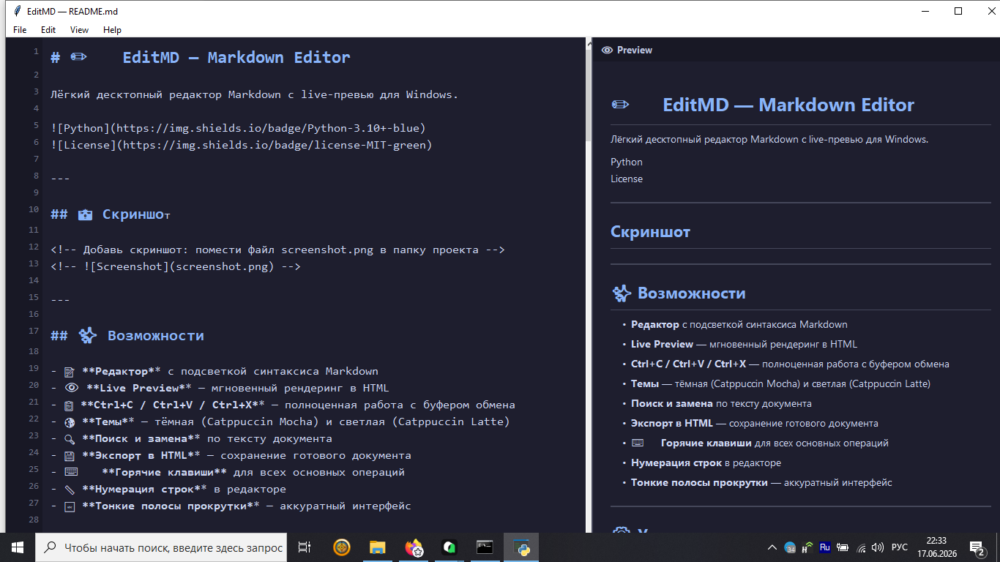

# ✏️ EditMD — Markdown Editor

Лёгкий десктопный редактор Markdown с live-превью для Windows.


---

## 📸 Скриншот

<!-- Добавь скриншот: помести файл screenshot.png в папку проекта -->
<!--  -->

---

## ✨ Возможности

- 📝 **Редактор** с подсветкой синтаксиса Markdown
- 👁 **Live Preview** — мгновенный рендеринг в HTML
- 📋 **Ctrl+C / Ctrl+V / Ctrl+X** — полноценная работа с буфером обмена
- 🌗 **Темы** — тёмная (Catppuccin Mocha) и светлая (Catppuccin Latte)
- 🔍 **Поиск и замена** по тексту документа
- 💾 **Экспорт в HTML** — сохранение готового документа
- ⌨️ **Горячие клавиши** для всех основных операций
- 📏 **Нумерация строк** в редакторе
- 🔤 **Тонкие полосы прокрутки** — аккуратный интерфейс

---

## ⚙️ Установка

### 1️⃣ Требования
- **Python 3.10+** ([скачать](https://www.python.org/downloads/))
- Windows 10 / 11

### 2️⃣ Зависимости

```bash
pip install markdown tkinterweb pygments
```

### 3️⃣ Запуск

```bash
python main.py
```

Или дважды кликните по **`EditMD.bat`**

---

## ⌨️ Горячие клавиши

| Комбинация | Действие |
|---|---|
| `Ctrl+N` | Новый файл |
| `Ctrl+O` | Открыть файл |
| `Ctrl+S` | Сохранить |
| `Ctrl+Shift+S` | Сохранить как |
| `Ctrl+E` | Экспорт в HTML |
| `Ctrl+Z` | Отменить |
| `Ctrl+Y` | Повторить |
| `Ctrl+X` | Вырезать |
| `Ctrl+C` | Копировать |
| `Ctrl+V` | Вставить |
| `Ctrl+B` | **Жирный** |
| `Ctrl+I` | *Курсив* |
| `` Ctrl+` `` | `Код` |
| `Ctrl+K` | Ссылка |
| `Ctrl+F` | Найти и заменить |
| `Ctrl+A` | Выделить всё |
| `Ctrl++` | Увеличить шрифт |
| `Ctrl+-` | Уменьшить шрифт |
| `F3` | Показать/скрыть Preview |

---

## 📖 Поддерживаемый синтаксис Markdown

### Заголовки
```markdown
# H1  |  ## H2  |  ### H3
```

### Форматирование
```markdown
**жирный**  |  *курсив*  |  `код`
```

### Списки
```markdown
- Элемент 1
- Элемент 2
  - Вложенный
```

### Таблицы
```markdown
| Заголовок 1 | Заголовок 2 |
|-------------|-------------|
| Ячейка 1    | Ячейка 2    |
```

### Блоки кода
````markdown
```python
def hello():
    print("Hello!")
```
````

### Ссылки и изображения
```markdown
[Текст](https://example.com)

```

---

## 🏗 Структура проекта

```
EditMD/
├── main.py         # Основной файл приложения
├── EditMD.bat      # Ярлык запуска (Windows)
├── .gitignore      # Исключения для git
└── README.md       # Документация
```

---

## 🛠 Технологии

| Компонент | Библиотека |
|-----------|-----------|
| GUI | `tkinter` (встроен в Python) |
| Markdown парсер | `markdown` |
| HTML Preview | `tkinterweb` |
| Подсветка кода | `pygments` |

---

## 📄 Лицензия

MIT — свободное использование с указанием авторства.

---

## 🤝 Вклад

Приветствуются Issues и Pull Requests на [GitHub](https://github.com/sskkaa130560-hue/EditMD).
